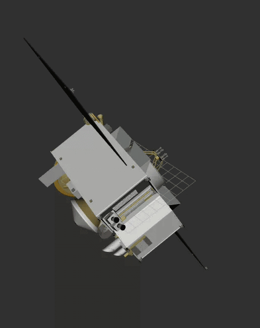
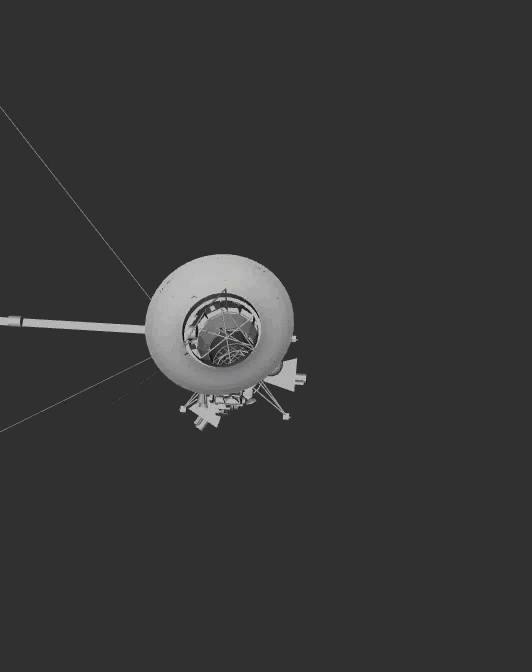

<h1 align="center">
Spacecraft visualized
</h1>

See ([https://github.com/HaofeiMa/urdf_ros2_rviz2](https://github.com/HaofeiMa/urdf_ros2_rviz2)) for the main template from which this packgae was developed.

# Launching the simulation

```
ros2 launch space_viz view_robot_launch.py urdf_file:=osiris_rex.urdf
```

# Some examples 




